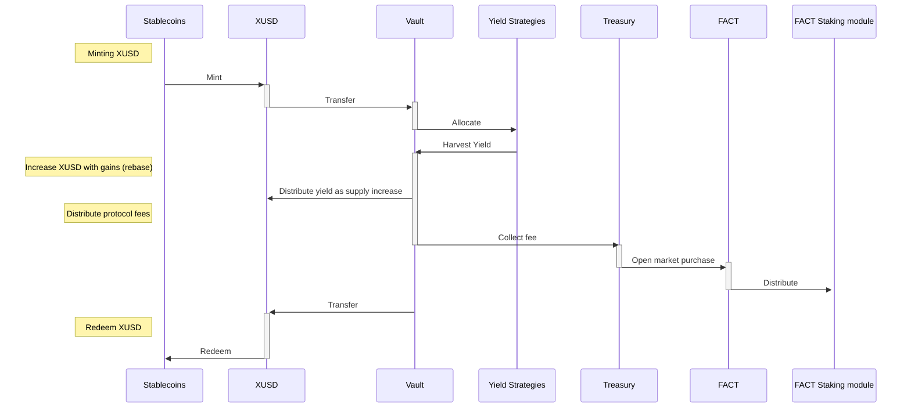

# Tokenomics

##### XUSD can be minted with or redeemed for stable coins
* Redemption carries nominal fee (0.5%) paid to treasury
##### Stable coins in vault are deposited into strategies
* Adjustable buffer reduces futile cycles
##### Strategies generate yield increasing treasury value
* Deposit-type investments are tracked
* Rewards tokens are periodically sold for stablecoins and reinvested
##### XUSD in wallets (EOAs) are rebased to account for change in vault value
* Adjustable Portion of yield paid to treasury, initially 0%
##### Treasury purchases governance token on open market using treasury funds
##### Treasury distributes governance token to stakers
##### Governance token confers voting rights

### Sequence Diagram

    D --> |Redeem|A
    D --> |Transfer funds | E
    E[Vault] -->|Allocate funds| F(Yield strategies)
    F -->|Harvest gains| E
    E --> |Distribute gains| D
    D --> |rebase supply|D
    E --> |Collect protocol fee| G(Treasury)
    G --> |Buy FACT with collected fee| G
    G --> |Distribute FACT| H(FACT Staking module)

