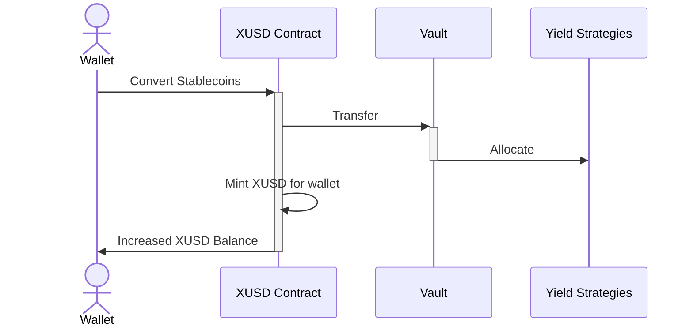
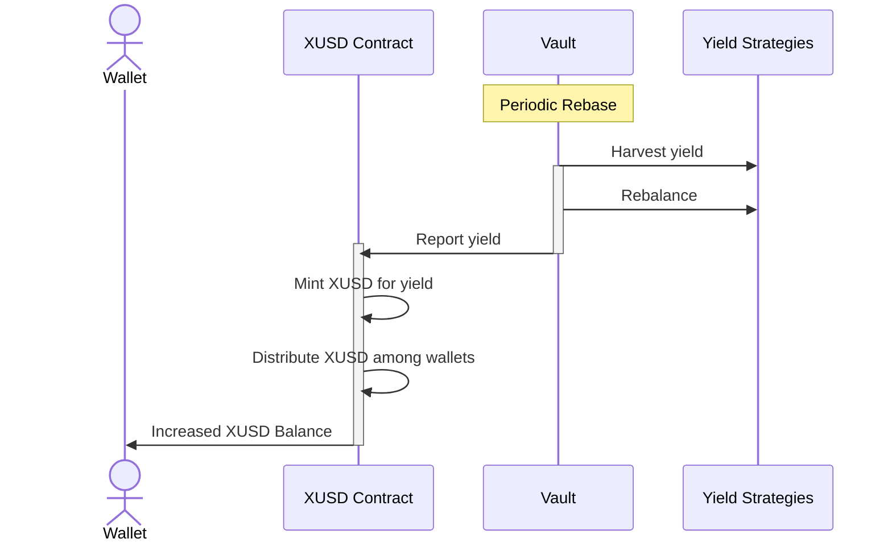
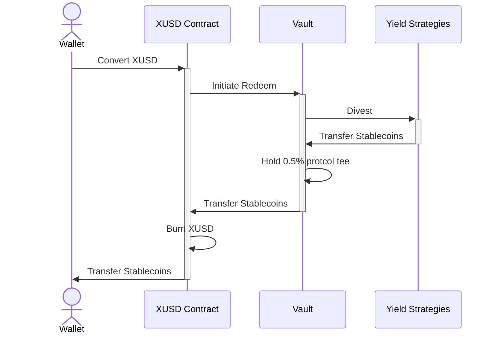

# Tokenomics

### XUSD can be minted with or redeemed for stable coins
* Redemption carries nominal fee (0.5%) paid to 
* Stable coins in vault are deposited into strategies
* Adjustable buffer reduces futile cycles

### Strategies generates yield and XUSD increases supply
* Deposit-type investments are tracked
* Rewards tokens are periodically sold for stablecoins and reinvested
* XUSD in wallets (EOAs) are rebased to account for change in vault value
* Adjustable Portion of yield paid to treasury, initially 0%

### XUSD is always fully redeemable for stablecoins
* Redemption always possible for full value of XUSD
* Backing assets are liquidated from yield strategies if necessary

### Reward governance token (FACT) from protocol fees & liquidity pools
* FACT is [not yet launched](/roadmap#table-stakes)
* Vault purchases governance token on open market using collected protocol fees
* Vault distributes governance token to FACT stakers and XUSD liquidity providers
* Governance token confers voting rights

